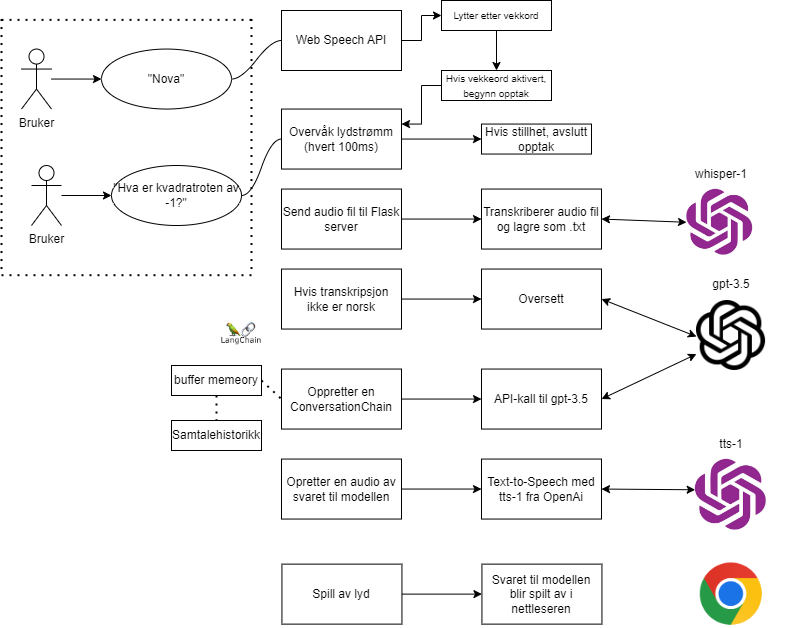

# Course project: Voice Activated Personal Assistant

by: Endre Nordtvedt & Preben Andersen

## Introduction

### The problem?

Student Assistent. I en hektisk hverdag som student er det ikke alltid så lett å henge med på alle gjøremål og deadlines. Det dukker også stadig opp spørsmål en måtte ha. Da er det greit med en assistent som har svaret på alt. Stemme assistenten “Nova” skal være studentens beste venn når det kommer til påminnelser, kommende gjøremål og generelle spørsmål.

En kan bruke telefonen til dette, men av erfaring mener gruppens medlemmer at en kommer på ting en må huske i tider og utider samt ting en lurer på dukker opp når en ikke venter det. Dette kan være når en står i dusjen, telefonen lader, en lager mat eller telefonen er tom for strøm. Her er det fint med en assistent som står i stuen for eksempel og en kan legge til påminnelser NÅR en kommer på disse.

Bonus:
1: Legge applikasjonen over på en enhet som raspberry pi. Gruppen kommer i føste omgang til å lage en web-app men, om det er tid og kapasitet så vil gruppen få applikasjonen over på enhet. Dette vil gjøre visjonen om en student assistent som alltid er tilgjengelig mer realistisk og faktisk brukenes.
2: Stemmegjenkjenning. Vi ønsker at applikasjonen skal kjenne igjen stemmen til flere brukere og legge til påmindelser og minne denne brukeren på tidsfrister og lignende utifra hvem som spør. Dette kan være aktuelt i kollektiv hvor flere studenter bor sammen.

### Challenges

Noe som kan bli en utfordring er å få applikasjonen til å starte når ordet “Nova” blir sagt. Men dette er en kritisk funksjon til å få assistenten til å bli stemmeaktivert. Gruppen må også vurdere navn på hva assistenten skal hete. Dette blir et “Wakeword” for å starte assistenten. Noen navn er bedre aktivering- ord enn andre. Ordet “Siri” eller “Alexa” kom nok frem etter mye og omfattende research på dette området. Her skal gruppen prøve å eksprimentere hva som gjør at "Siri" og "Alexa" blir brukt, slik at Student assistenten kan få tildelt et fornuftig navn og aktiveringsord.

En annen utfordring kan være å få assistenten til å riktig kjenne igjen stemmen. Stemmer kan ofte forandre seg litt, for eksempel ved halsbetennelse, sykdom, hvor nært du står assistenten eller andre grunner.

## Design

### Design of the project

Lytte på wakeword 
Gruppen har etter testing og utprøving av forskjellige metoder å detektere aktiveringsordet, landet på Web Speech API. Her benytter gruppen metoden "onstart()" for å gi bruker feedback på at applikasjonen er igang. Det blir så brukt metoden "onresult()" som lytter etter aktiveringsordet "Nova" for å starte "startRecoding()" metoden som er hentet fra MediaStream Recording API. Denne metoden bruker mikrofonen på pcen til bruker til å ta opp lyd.

Transcribering og behandling av audio
Når tale blir oppdaget av Web Speech API blir den transkribert og lagret som en tekstfil i (TEXT_INPUT_FOLDER). Teksten fra denne filen blir sendt til OpenAi's sin Large Language Model (LLM) vet hvelp av OpenAi sitt API for å kunne gi en respons. Responsen er altså svaret fra modellen. Modellen brukt er GPT-3.5-Turbo. Promptet til modellen er per nå:

```
// Du er en hyggelig og jovial AI assistent som heter Nova.
// Du svarer kort og konsist på spørsmål.
// Du dikter ikke opp ting og svarer bare dersom du vet svaret.
// Svar alltid på norsk."
```

Men i senere tid ville man kunne laget applikasjonen og modellen mer spesifikk til arbeidsoppgavene. Nå ønsker gruppen i første omgang å ha en generell Ai assistent som svarer på spørsmål fra bruker.

text to speech
Responsen blir gjort om til tale vet hjelp av tts-1 (text-to-speech) fra OpenAi. Denne blir lagret som en audiofil og spilt av av applikasjonen. 

Frontend:
Gruppen har laget en frontend for å gjøre applikasjonen mer engasjerende å bruke. Når applikasjonen starter vises en blå sirkel. Denne står i ro i en såkalt "default" state hvor appen er klar for å brukes. Når aktiveringsordet "Nova" blir oppdaget begynner sirkelen å pulsere og bilde av et øre dukker opp i sirkelen for å indikere at applikasjonen lytter. Når spørringen er ferdig kommer et symbul som indikerer prosessering av inputen fra bruker og til slutt kommer et "speaker" sybol for å indikere at applikasjonen kommer med output i form av audio. Hele denne tiden pulserer sirkelen for å indikere at applikasjonen jobber. Frontend er skrevet med HTML og CSS.

Azure
Hoster applikasjonen som en web-app i Azure. Link til applikasjonen er:
[web-app](https://youraiassistant.azurewebsites.net)

Designet og arkitekturen på web-appen ser slik ut:



## Result

## Discussion and future work

### What we accomplished

Gruppen laget en enkel web applikasjon som er deployed og kjøres i Azure. Når applikasjonen starter så begynner den å lytte etter "wakeword". Deretter kan brukeren spørre om spørsmål og legge igjen notater som modellen kan minne bruker på senere. Når "wakeword" oppdages, transcriberer modellen det som blir sagt og gir denne teksten inn i Openai's modell utnyttet via Openai's API. Når modellen gir et svar så blir svaret gjort om til tale og gitt ut til bruker.

Gruppen har også laget en notebook som tar inn forslag til navn, lest inn av et av gruppemedlemmene, og visualiserer navnene med wave-bilder og fargebilde. Da gruppen ikke hadde mye data av hva som er ett "Bra" stemmeassistennavn forruten om "Siri" og "Alexa" så trente vi ikke en modell, men heller sammenlignet bildene med forslagene som gruppen kom med men også forslag fra chatGPT. Gruppen prøvde å se mønster i de "gode" navnene og prøve å finne de igjhen i navnforslagene. Ut i fra gruppens sammenligninger med gode wakeword som "Siri" og "Alexa", ble "Nova" valgt og ser ut til å fanges opp av applikasjonen på en god måte. "Lyra" var også et godt forslag men har ser gruppen utfordringer med dialekt og språk. "Lyra" kan sies på tre forskjellige måter på østlandsk, Bergensk og Engelsk.

### What we wanted to, but did not accomplish

Som beskrevet mer i detalj i diskusjons-delen av rapporten så gikk det mer tid til utforsking og prøve på å implementere kul teknologi i web-appen. Derav ble web-applikasjonen enklere enn gruppen ønsket og produktet ble en assistent som svarer på spørsmål siden gruppen ikke kom helt i mål m,ed kalender tilkobling. En kan si vi hadde litt høye ambisjoner for prosjektet og ønsket å få til veldig mye på relativt kort tid med tanke på at vi begge skriver bacheloroppgavene våre i tillegg til faget.

Som en bonus oppgave ville vi få web applikasjonen over på raspberry pi. Da ingen av gruppemedlemmene har noe tidligere ærfaring med denne ble en del av tiden ved prosjektstart satt til å finne ut hvordan den fungerer og kan brukes. Då vi skjønte at det kanskje ble litt for omfattende i forhold til alt vi ville få til, valgte gruppen å prioritere web-applikasjonen.

### Discussion

Da det var mye frem og tilbake og gruppen testet mange forskjellige stemmegjennkjenningsmodeller som Openai's Whisper og Google sin speech recognition model samt annen spennede teknologi så ble ikke sluttresultatet helt som planlagt. Dette er fordi då vi hadde fått til noe fungerende ønsket vi å implementere mer kul tenkologi som forskjellige stemmer med ElevenLabs også i tillegg ønsket vi å gjøre research på hvordan en kan implementere en Avatar som svarer bruker med for elksempel D-ID. Gruppen prøvde seg på menge forskjellige teknologier vi ønsket å implementere i applikasjonen men, dette førte heller til mer arbeid enn først anntatt. Ved en ny implementasjon så måtte koden forandres og dermed måtte gruppen starte litt fra start med en ny modell fordi vi ville da lage den bedre enn den forrige.

### Future work

Gruppen vil få til å lage en fungerende web-applikasjon til prosjektets sluttdato. Videre arbeid og om gruppen hadde hat mer tid og kapasitet til å jobbe med prosjektet, vil være å implementere applikasjonen over på en raspberry pi enhet. For dette kreves det å sette seg litt mer inn i raspberry pi systemet. Gruppen vil også jobbe med stemmegjenkjenning.

### Conclusion

En kan konkludere med at det finnes veldig mye stilige løsninger og teknologier en kan jobbe med. Vi ser at dette nyskjerrigheten på dette gjorde at sluttproduktet ikke ble bra som vi ønsket då vi prøvde mye forskjellig. Skulle vi sartet på nytt hadde vi gjerne valgt en måte å gjøre ting på og fokusert på denne. Sluttproduktet ble som nevnt en enkel web-applikasjon hostet av Azure med et simpelt frontend design. Assistenten svarer bruker på spørsmål bruker stiller. Vi begynte å se på logikken med å koble til en kalender ved å bruke agents men kom ikke helt i mål med dette. Produktet kan jobbes videre med og gjøres enda bedre og mer avansert og til slutt føres over på en raspberry pi som har vært gruppens mål hele veien. Dette ønsker gruppen å jobbe videre med.

### References

For referanser brukt i prosjektet, se [./references/references.md](./references/references.md)
